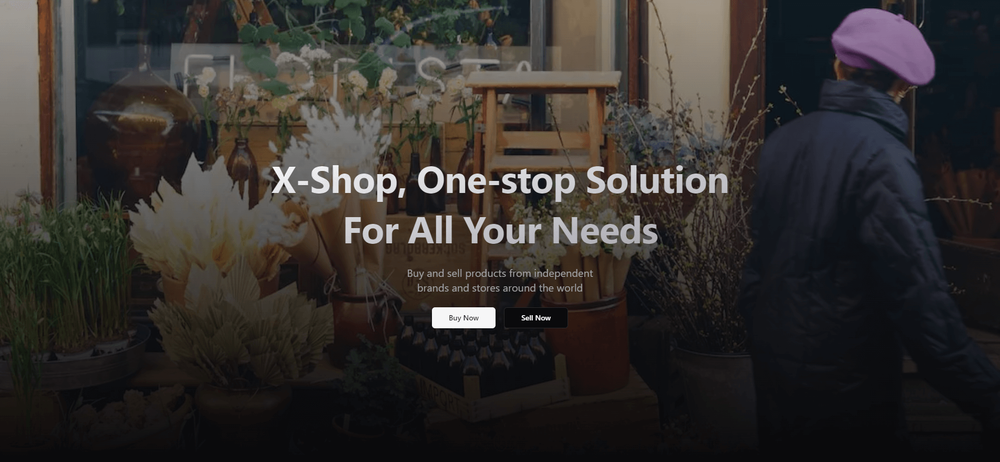

# X-Shop

[](https://x-shop-app.vercel.app/)

An open-source e-com application built using all new [NextJS](https://nextjs.org/) with React server components.

> **Warning**
> This project is still in development and is not ready for production use.

## Tech Stack

- **Framework** : [NextJS](https://nextjs.org/)
- **Auth** : [Clerk](https://clerk.com/)
- **DB** : [TursoDB](https://turso.tech/) (SQLite)
- **ORM** : [Drizzle ORM](https://orm.drizzle.team/)
- **File Uploads** : [Uploadthing](https://uploadthing.com/)
- **UI Components** : [shadcn/ui](https://ui.shadcn.com/docs)
- **Styling** : [Tailwind CSS](https://tailwindcss.com/)

## Running Locally

Make sure you have Node `v18.0.0` or higher [^1]

1. Install dependencies using pnpm:

    ```bash
    pnpm install
    ```

2. Copy `.env.example` to `.env` and update the variables.

    ```bash
    cp .env.example .env.local
    ```

3. Create local db

    ```bash
    pnpm db:push
    ```

4. Start the development server:

    ```bash
    pnpm dev
    ```

## Deploy on Vercel

You can easilly depoy with vercel:

[](https://vercel.com/new/clone?repository-url=https%3A%2F%2Fgithub.com%2FKingBael09%2FX-Shop&project-name=x-shop&repository-name=x-shop)

Note that you'll need to:

- Set up [Uploadthing](https://uploadthing.com)
- Set up [Clerk Auth](https://clerk.com)
- Set up [Turso DB](https://turso.tech) [^2]

[^1]: Prefer pnpm `v8.7.6` or higher to install dependencies
[^2]: For deployment you'll need Turso (not required for local)
